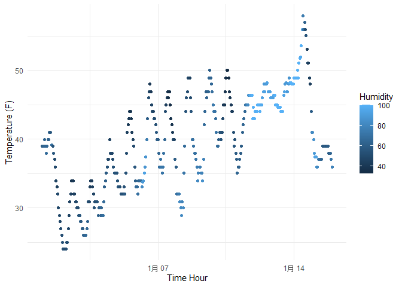

p8105_hw1_zj2358
================
Zhezheng Jin
2023-09-17

## Problem 1

# Load the dataset

``` r
library(moderndive)
data("early_january_weather")
```

# View the dataset structure

``` r
?early_january_weather
```

    ## starting httpd help server ... done

# Number of rows and columns in the dataset

``` r
nrow(early_january_weather) 
```

    ## [1] 358

``` r
ncol(early_january_weather) 
```

    ## [1] 15

# Mean temperature

``` r
mean(early_january_weather$temp)
```

    ## [1] 39.58212

# Description of dataset “early_january_weather”

The “early_january_weather” dataset contains hourly meteorological data
for January 2013 from three weather stations (LGA, JFK, EWR) in the New
York City area.This is a subset of the weather data frame from
nycflights13. It includes 15 variables: origin: Weather station.

year, month, day, hour: Time of recording.

temp, dewp: Temperature and dewpoint in F.

humid: Relative humidity.

wind_dir, wind_speed, wind_gust: Wind direction (in degrees), speed and
gust speed (in mph).

precip: Precipitation, in inches.

pressure: Sea level pressure in millibars.

visib: Visibility in miles.

time_hour: Date and hour of the recording as a POSIXct date.

The dataset comprises 358 rows and 15 columns.

The mean temperature for the dataset is 39.58 F.

# Load the required libraries

``` r
library(ggplot2)
```

# Create the scatterplot

``` r
scatterplot <- ggplot(early_january_weather, aes(x = time_hour, y = temp, color = humid)) +
  geom_point() +
  labs(
    x = "Time Hour",
    y = "Temperature (F)",
    color = "Humidity"
  ) +
  theme_minimal()
```

# Display the scatterplot

``` r
scatterplot
```

<!-- -->

# Describe patterns

There is a non-linear trend between Temperature and Time Hour. The
temperature Range is from about 24 to 58 F. Clusters of points in the
plot are concentrated in the range of 35-50 F. There’s a consistent
relationship between temperature and humidity. As humidity increases,
temperatures tend to increase.

# Export to the project directory

``` r
ggsave("scatterplot_temp_vs_time_hour.png", scatterplot, width = 10, height = 6)
```

## Problem 2

# Load the tidyverse package

``` r
library(tidyverse)
```

    ## ── Attaching core tidyverse packages ──────────────────────── tidyverse 2.0.0 ──
    ## ✔ dplyr     1.1.3     ✔ readr     2.1.4
    ## ✔ forcats   1.0.0     ✔ stringr   1.5.0
    ## ✔ lubridate 1.9.2     ✔ tibble    3.2.1
    ## ✔ purrr     1.0.2     ✔ tidyr     1.3.0
    ## ── Conflicts ────────────────────────────────────────── tidyverse_conflicts() ──
    ## ✖ dplyr::filter() masks stats::filter()
    ## ✖ dplyr::lag()    masks stats::lag()
    ## ℹ Use the conflicted package (<http://conflicted.r-lib.org/>) to force all conflicts to become errors

# Set a random seed for reproducibility

``` r
set.seed(123)
```

# Create the data frame

``` r
zj_df <- data.frame(
  random_samp = rnorm(10),                
  logical_vector = rnorm(10) > 0,           
  character_vector = sample(letters, 10, replace = TRUE),  
  factor_vector = as.factor(sample(1:3, 10, replace = TRUE)) 
)
```

# Calculate the mean for each variable

``` r
mean_random <- mean(pull(zj_df, random_samp))
mean_logical <- mean(pull(zj_df, logical_vector))
mean_character <- mean(pull(zj_df, character_vector))
```

    ## Warning in mean.default(pull(zj_df, character_vector)): argument is not numeric
    ## or logical: returning NA

``` r
mean_factor <- mean(pull(zj_df, factor_vector))
```

    ## Warning in mean.default(pull(zj_df, factor_vector)): argument is not numeric or
    ## logical: returning NA

After calculation, the random sample, and logical vector have mean
values, but the character vector and factor vector do not have.

# Convert logical, character, and factor variables to numeric

``` r
zj_df$logical_vector_numeric <- as.numeric(zj_df$logical_vector)
zj_df$character_vector_numeric <- as.numeric(zj_df$character_vector)
```

    ## Warning: NAs introduced by coercion

``` r
zj_df$factor_vector_numeric <- as.numeric(zj_df$factor_vector)
```

# Calculate the mean value again

``` r
mean_random <- mean(pull(zj_df, random_samp))
mean_logical <- mean(pull(zj_df, logical_vector_numeric))
mean_character <- mean(pull(zj_df, character_vector_numeric))
mean_factor <- mean(pull(zj_df, factor_vector_numeric))
```

After the recalculation, the factor vector has a mean value, but the
mean value of the character vector is still unvailable. Because
as.numeric will convert the levels of the factor to their internal
integer representations.This conversion to numeric values doesn’t help
explain what happens when trying to take the mean because the numeric
values may not hold the same meaning as the original data.
